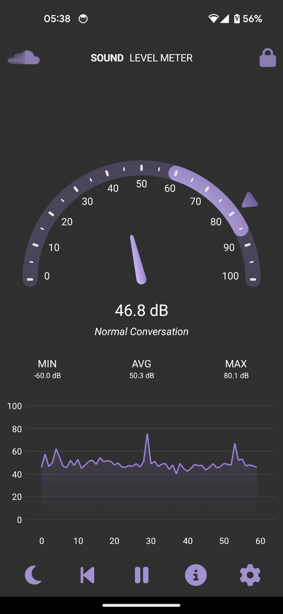

# Sound Level Meter Application




This is a sound level meter application built with .NET MAUI, utilizing ManagedBass for audio processing, and designed following the MVVM architectural pattern.

## Features

- Real-time sound level measurement
- Visual representation of sound wave
- Decibel level logging

## Prerequisites

- .NET 6 SDK or later
- Visual Studio 2022 or JetBrains Rider with .NET MAUI support

## Libraries Used

- **.NET MAUI** - A cross-platform framework for creating native mobile and desktop apps with C# and XAML.
- **ManagedBass** - A free and open-source audio library, a .NET wrapper for the BASS Audio Library.
- **Bass Audio Library** - An audio library for use in software on several platforms. Its purpose is to provide developers with powerful and efficient sample, stream, MOD music, and recording functions.

## Getting Started

To run the Sound Level Meter application:

1. Clone the repository:
   ```bash
   git clone https://github.com/ncthanh088/LoudnessMeter.git
